# 全体設計

## 1. 全体イメージ

## 2. 個別概要
### 2.1. 駅データCSV作成
駅すぱあと API による、駅データの取得と、
Google Map Platform の Places API による 緯度経度 での周辺検索データを利用して、
駅周辺にコーヒーチェーン店の情報をまとめたCSVデータを作成する。
データの加工には、PostgreSQLによるデータベース操作を使用する。

### 2.2. サイトデータ出力
静的サイトジェネレーター（Gatsby）を使用し、
駅データCSVデータを元に、ページコンテンツとなる静的サイトのデータを出力する。

### 2.3. サイト公開
出力された静的サイトのデータを、公開用リポジトリにデプロイする。
サイトの公開とデプロイには Netlify を使用する。

## 3. 使用サービス一覧
- [駅すぱあと API](https://ekiworld.net/service/sier/webservice/free_provision.html)
- [Google Map Platform Places API](https://developers.google.com/maps/documentation/places/web-service/overview)
- [PostgreSQL](https://www.postgresql.org/)
- [Gatsby](https://www.gatsbyjs.com/)
- [Netlify](https://www.netlify.com/)

