# 全体設計

## 1. 全体イメージ

## 2. 個別概要
### 2.1 PlacesAPIリクエスト作成
**create_placesapi_request**  
駅データJPのCSVデータを使用して、駅データの取得を行い、
PostgreSQL の DB に格納。
独自定義のデータも DB に格納した上で、SQL によりデータを加工し、
Google Cloud Platform の Places API のリクエストで使用する、
駅の 緯度経度 を記したデータを作成する。

### 2.2 PlacesAPIリクエスト実行
**execution_placesapi_request**  
作成した、駅の 緯度経度 情報を利用して、
Google Cloud Platform の Places API に実際にリクエストを送り、
レスポンスデータを DB に格納する。

### 2.3 サイトページコンテンツ作成
**create_site_page_contents**  
Google Cloud Platform の Places API のレスポンスデータを加工し、サイトのコンテンツデータとなる、
駅周辺のコーヒーチェーン店情報をまとめたデータを作成する。

### 2.4. 静的サイトデータ出力
**build_static_site_data**  
静的サイトジェネレーター（Gatsby）を使用し、
コンテンツCSVデータを元に、ページデータとなる静的サイトのファイルを出力する。

### 2.5. サイト公開
**deploy_site**  
出力された静的サイトのデータを、公開用サイトにデプロイする。
サイトの公開とデプロイには Netlify を使用する。

## 3. 処理の実行方法
処理の実行には OSS のジョブ実行ツールの Rundeck を使用する。
ただし、時間指定の自動実行はせず、最短月単位での手動実行とする。

## 4. 使用サービス・ツール一覧
- [駅すぱあと API](https://ekiworld.net/service/sier/webservice/free_provision.html)
- [Google Cloud Platform Places API](https://developers.google.com/maps/documentation/places/web-service/overview)
- [PostgreSQL](https://www.postgresql.org/)
- [Gatsby](https://www.gatsbyjs.com/)
- [Netlify](https://www.netlify.com/)
- [Rundeck](https://www.rundeck.com/)

