# PlaceAPIリクエスト実行

## 1. 概要
作成した、駅の 緯度経度 情報を利用して、
Google Cloud Platform の Places API に実際にリクエストを送り、
レスポンスデータを DB に格納する。

## 2. 個別処理概要

- 取得対象チェーンCSV読込 (データ取得対象チェーンCSV → 取得対象チェーンTBL)
  - 取得対象チェーンテーブル全削除
  - 取得対象チェーンCSV読込
- カフェ情報読込
  - カフェ情報取得 (カフェチェーンマスタTBL ・ 取得対象チェーンTBL ・PlacesAPIリクエスト用CSV → Places API → カフェ情報一時CSV)
  - カフェ情報読込 (カフェ情報一時CSV → カフェ情報TBL)
- カフェ情報蓄積テーブル挿入
  - 駅カフェ情報作成 (カフェ情報TBL → 駅カフェ情報作成TBL)
  - カフェ情報蓄積テーブル挿入 (駅カフェ情報作成TBL → 駅カフェ情報蓄積TBL)

## 3. 処理フロー

