# サイトページコンテンツ作成

## 1. 概要
Google Cloud Platform の Places API のレスポンスデータを加工し、サイトのコンテンツデータとなる、
駅周辺のコーヒーチェーン店情報をまとめたデータを作成する。

## 2. 個別処理概要

- 定義事業者情報併合
  - 定義事業者情報テーブルデータ全削除
  - 定義事業者情報テーブル読込
  - 定義事業者情報併合テーブルデータ全削除
  - 定義事業者情報併合
- 事業者URL情報併合
  - 事業者URL情報テーブルデータ全削除
  - 事業者URL情報テーブル読込
  - 事業者URL情報併合テーブルデータ全削除
  - 事業者URL情報併合
- 定義路線情報併合
  - 定義路線情報テーブルデータ全削除
  - 定義路線情報テーブル読込
  - 定義路線情報併合テーブルデータ全削除
  - 定義路線情報併合
- ラインカラー情報併合
  - ラインカラーテーブルデータ全削除
  - ラインカラーテーブル読込
  - ラインカラー情報併合テーブルデータ全削除
  - ラインカラー情報併合
- 路線URL情報併合
  - 路線URL情報テーブルデータ全削除
  - 路線URL情報テーブル読込
  - 路線URL情報併合テーブルデータ全削除
  - 路線URL情報併合
- カフェ情報最新データ抽出
  - カフェ情報最新データ抽出テーブルデータ全削除
  - カフェ情報最新データ抽出
- 駅情報併合
  - 駅情報併合テーブルデータ全削除
  - 駅情報併合
- 接続駅情報併合
  - 接続駅情報併合テーブルデータ全削除
  - 接続駅情報併合
- 路線情報併合
  - 路線情報併合テーブルデータ全削除
  - 路線情報併合
- 事業者情報併合
  - 事業者情報併合テーブルデータ全削除
  - 事業者情報併合
- ページコンテンツCSV出力
  - ページコンテンツテーブルデータ全削除
  - ページコンテンツテーブル挿入
  - ページコンテンツCSV出力

## 3. 処理フロー

