# 駅カフェ情報作成

## 1. 概要
Places API から取得したレスポンスデータの CSV を DB に格納する。
その後、精度向上の為の情報を付与、情報を抽出して、
駅カフェ情報（緯度経度に対して対象のカフェがあるかの丸バツ表）を作成する。

## 2. 個別処理概要
- カフェ情報読込
  - カフェ情報テーブルデータ全削除
  - カフェ情報読込
  - カフェ情報蓄積テーブル挿入
- 検索チェック付与
  - 検索チェック付与テーブルデータ全削除
  - 検索チェック付与
- 駅カフェ情報作成
  - 駅カフェ情報作成テーブルデータ全削除
  - 駅カフェ情報作成
  - 駅カフェ情報蓄積テーブル挿入

## 3. 処理フロー

