# サイト公開

## 1. 概要
出力された静的サイトのデータを、公開用リポジトリにデプロイする。
サイトの公開とデプロイには Netlify を使用する。

## 2. 個別処理概要
- サイトデータZIP化 ( (root)/ssg/public フォルダ → (root)/data/ssg_contents.zip)
- サイトデプロイ ( (root)/data/ssg_contents.zip → Netlify API)
- ステータス確認 (Netlify API))

## 3. 処理フロー

